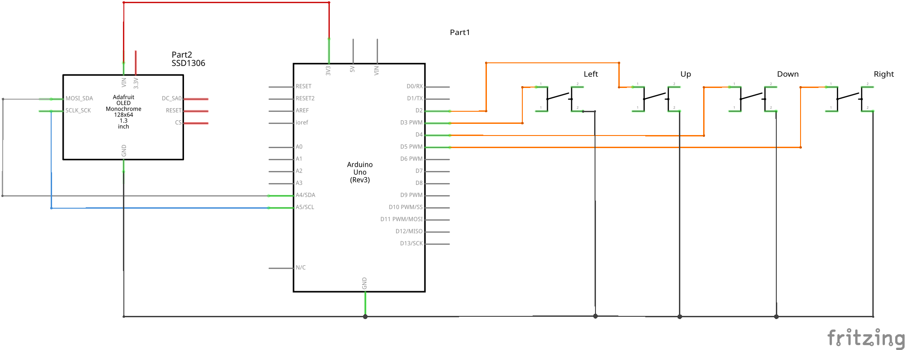

# Tiny Tiny Wordle
The World's smallest Wordle clone (Probably!)

This project brings this popular word game to the Arduino Uno and compatible boards, with a massive dictionary of up to 6000 words.

## Features
* The game that we all know and love
* A short tutorial
* Animations!
* Combos!!
* English dictionary with 2315 words
* Italian dictionary with 5984 words
* A custom compression algorithm and a super tiny version of the display and graphics library to make all this possible

## Requirements
* An Arduino Uno or compatible board
* A 128x64 Adafruit SSD1306 OLED display with I2C interface (that's the version with SDI/SCL pins and address 0x3C)
* 4 buttons, normally open
* A breadboard and some wires to put it all together

## Flashing
Inside the `arduino` folder, you'll find the `TinyTinyWordle` project, load it in the Arduino IDE and flash it.

By deafult, it builds the English version of the game, you can switch it to Italian by modifying `TinyTinyWordle.ino`.

## Custom dictionaries
Inside the `PC` folder, you'll find the tool I made to compress (or "cook", as I call it) a dictionary into an .h file that can be imported into the arduino project.

To build the tool, run `sh build.sh`. If everything goes well, you should see an executable file called `cookDictionary` appear. Please note that this was only tested on an x86_64 Linux machine.

A dictionary is a regular ASCII text file containing one word per line. All words must have the same length and only uppercase letters from A to Z are accepted by the program. Let's call this file `myDictionary.txt`. Take a look at the included `english.txt` and `italian.txt` files if you need an example.

To cook your dictionary, use `./cookDictionary myDictionary.txt`. If everything works well, you'll see two new files called `myDictionary.cooked.bin` and `myDictionary.arduino.h`, you'll need the second one. If there are errors, the program will tell you what's wrong with your dictionary file.

Copy `myDictionary.arduino.h` into the `arduino/TinyTinyWordle` folder, open the `locale-en.h` file and copy all the defines at the beginning of your new `myDictionary.arduino.h` file and save it.

To load the new dictionary into the game, open the `TinyTinyWordle.ino` file and replace `#include "locale-en.h"` with `#include "myDictionary.arduino.h"`.

If you did everything correctly, you can now flash your version and it will work.

## Credits
The dictionaries for this application were taken (and slightly modified) from [Gurgle](https://github.com/billthefarmer/gurgle), an Android clone of the game.

## License
Copyright (C) 2022 Federico Dossena

This program is free software: you can redistribute it and/or modify
it under the terms of the GNU General Public License as published by
the Free Software Foundation, either version 3 of the License, or
(at your option) any later version.

This program is distributed in the hope that it will be useful,
but WITHOUT ANY WARRANTY; without even the implied warranty of
MERCHANTABILITY or FITNESS FOR A PARTICULAR PURPOSE.  See the
GNU General Public License for more details.

You should have received a copy of the GNU General Public License
along with this program.  If not, see <http://www.gnu.org/licenses/>.
